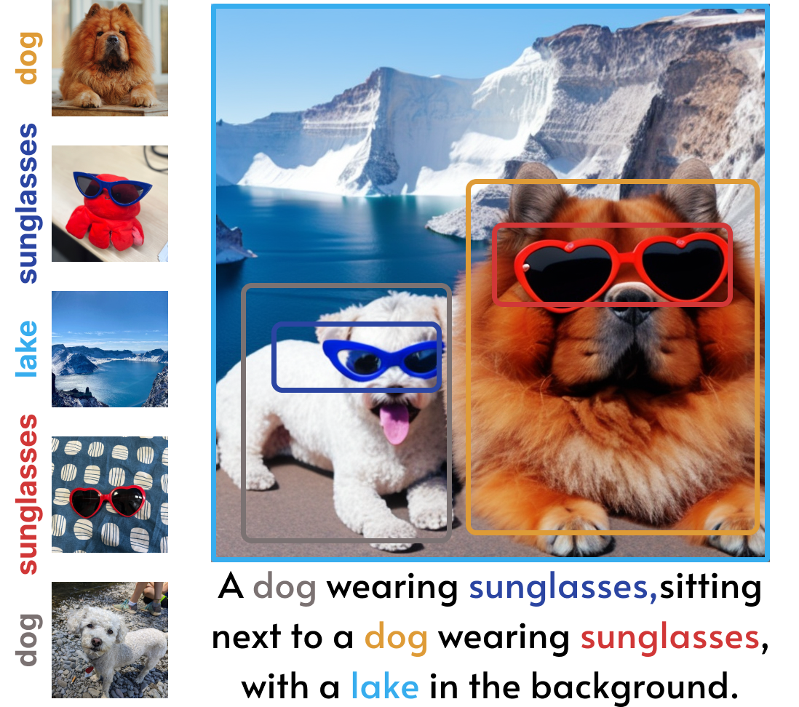
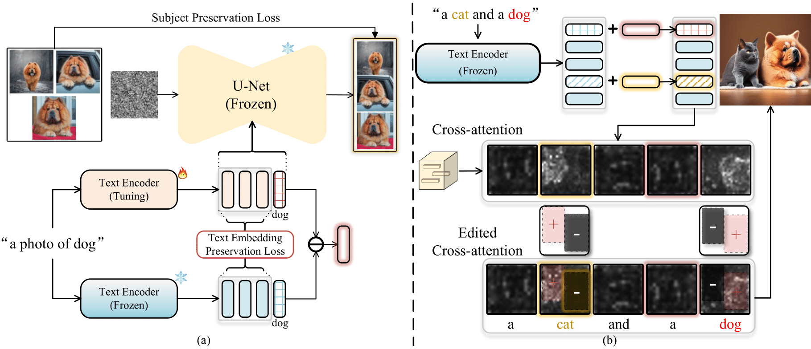

# Cones 2

Official repo for [Cones 2: Customizable Image Synthesis with Multiple Subjects].

See [Project Page](https://cones-page.github.io/) for more examples.
<div align=center>

</div>
<!-- *(Concept of Composer)* -->

Cones 2 uses a simple yet effective representation to register a subject. The storage space required for each subject is approximately **5 KB**. Moreover, Cones 2 allows for the flexible composition of various subjects **without any model tuning**.


## TODO

- [ ] Release code in next week.
- [ ] Release Gradio UI.

## Method



(a) Given few-shot images of the customized subject, we fine-tune the text encoder to learn a residual embedding on top of the base embedding of raw subject. (b) Based on the residual embeddings, we then propose to employ layout as the spatial guidance for subject arrangement into the attention maps. After that, we could strengthen the signal of target subjects and weaken the signal of irrelevant subjects.

## Results


<!-- ## BibTeX -->

<!-- ```bibtex
@article{lhhuang2023composer,
  title={Composer: Creative and Controllable Image Synthesis with Composable Conditions},
  author={Huang, Lianghua and Chen, Di and Liu, Yu and Yujun, Shen and Zhao, Deli and Jingren, Zhou},
  booktitle={arXiv preprint arxiv:2302.09778},
  year={2023}
}
``` -->
