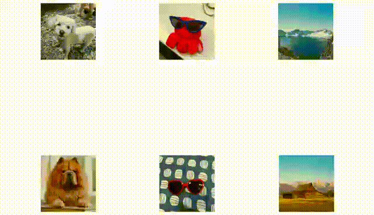

# Cones 2

Official repo for [Cones 2: Customizable Image Synthesis with Multiple Subjects](https://arxiv.org/abs/2305.19327) | [Project Page](https://cones-page.github.io/).
<br>
<div class="gif">
<p align="center">

</p>
</div>

[Cones 2](https://cones-page.github.io/) allows you to represent a specific subject as a **residual embedding** by 
fine-tuning text encoder in a pre-trained text-to-image diffusion model, such as 
[Stable Diffusion](https://github.com/CompVis/stable-diffusion). After tuning, we only need to save the residual between tuned text-encoder and frozen 
one. Thus, the storage space required for each additional subject is only **5 KB**. This step only takes about 20~30 minutes on a single 80G A100 
GPU for each subject. 

When sampling, our **layout guidance sampling** method further allows you to employ a easy-to-obtain layout as guidance for multiple subjects 
arrangement as shown in the following figure. 

<p align="center">
<a id="teaser"></a>

</p>

## Results

All results are synthesized by pre-trained [Stable Diffusion v2.1](https://huggingface.co/stabilityai/stable-diffusion-2-1) 
models and our customized residual embeddings. We show diverse results on various categories of images, including 
scene, pet, personal toy, human _etc._. For more results, please refer to our [paper](https://arxiv.org/abs/2305.19327) or [website](https://cones-page.github.io/).

### Two-Subject Results


### Three-Subject Results


### Four-Subject Results


### More Results


## Method


(a) Given few-shot images of the customized subject, we fine-tune the text encoder to learn a residual embedding on top 
of the base embedding of raw subject. (b) Based on the residual embeddings, we then propose to employ layout as the 
spatial guidance for subject arrangement into the attention maps. After that, we could strengthen the signal of target 
subjects and weaken the signal of irrelevant subjects. For more details, please refer to our [paper](https://arxiv.org/abs/2305.19327).

## Getting Started

### Installing the dependencies

The implementation of Cones 2 is based entirely on the [diffuser](https://github.com/huggingface/diffusers/tree/main).
Before running out code, make sure to install the library's training dependencies. To do this, execute the following 
steps in a new virtual environment:

```bash
git clone https://github.com/damo-vilab/Cones-V2.git
cd Cones-V2
pip install -r requirements.txt
```

Then initialize an [🤗—Accelerate](https://github.com/huggingface/accelerate/) environment with:

```bash
accelerate config
```

Or for a default accelerate configuration without answering questions about your environment

```bash
accelerate config default
```

## Training (Flower example)

Firstly, let's download dataset from 
[here](https://modelscope.cn/api/v1/datasets/zyf619/cones2_residual/repo?Revision=master&FilePath=data.zip) 
and unzip it to `./data`. Now a few images of Flower (download to `./data/flower`) are used to learn its 
customized residual embedding.

```bash
export MODEL_NAME='path-to-stable-diffusion-v2-1'
export INSTANCE_DIR="./data/flower"
export OUTPUT_DIR="path-to-save-model"
accelerate launch train_cones2.py \
  --pretrained_model_name_or_path=$MODEL_NAME  \
  --instance_data_dir=$INSTANCE_DIR \
  --instance_prompt="flower" \
  --token_num=1 \
  --output_dir=$OUTPUT_DIR \
  --resolution=768 \
  --train_batch_size=1 \
  --gradient_accumulation_steps=1 \
  --learning_rate=5e-6 \
  --lr_scheduler="constant" \
  --lr_warmup_steps=0 \
  --max_train_steps=4000 \
  --loss_rate_first=1e-2 \
  --loss_rate_second=1e-3
```

## Inference

Once you have trained several residual embeddings of different subjects using the above command, you can run our 
**layout guidance sampling method** simply using [inference.py](inference.py). We provide several pre-trained 
models for quick validation. 

<table style="margin: auto">
  <tr>
    <th>residual embedding</th>
    <th>raw token</th>
    <th>download</th>
  </tr>
  <tr>
    <td>barn</td>
    <th>barn</th>
    <td><a href="https://www.modelscope.cn/api/v1/datasets/zyf619/cones2_residual/repo?Revision=master&FilePath=barn.pt">barn.pt</a></td>
  </tr>
  <tr>
    <td>white dog</td>
    <th>dog</th>
    <td><a href="https://www.modelscope.cn/api/v1/datasets/zyf619/cones2_residual/repo?Revision=master&FilePath=dog.pt">dog.pt</a></td>
  </tr>
  <tr>
    <td>flower</td>
    <th>flower</th>
    <td><a href="https://www.modelscope.cn/api/v1/datasets/zyf619/cones2_residual/repo?Revision=master&FilePath=flower.pt">flower.pt</a></td>
  </tr>
  <tr>
    <td>lake</td>
    <th>lake</th>
    <td><a href="https://www.modelscope.cn/api/v1/datasets/zyf619/cones2_residual/repo?Revision=master&FilePath=lake.pt">lake.pt</a></td>
  </tr>
  <tr>
    <td>mug</td>
    <th>mug</th>
    <td><a href="https://www.modelscope.cn/api/v1/datasets/zyf619/cones2_residual/repo?Revision=master&FilePath=mug.pt">mug.pt</a></td>
  </tr>
  <tr>
    <td>sunglasses</td>
    <th>sunglasses</th>
    <td><a href="https://www.modelscope.cn/api/v1/datasets/zyf619/cones2_residual/repo?Revision=master&FilePath=sunglasses.pt">sunglasses.pt</a></td>
  </tr>
</table>


Remember to provide a pre-defined layout like [layout_example.png](pics/layout_example.png) and a 
[json](guidance_config_example.json) file with the info about the details of the inference settings. The 
[json](guidance_config_example.json) file should include the following information:

- "prompt": the text prompt you want to generate.
- "residual_dict": the paths to all the required residual embeddings.
- "color_context": the color information of different regions in the layout and their corresponding subjects, along with 
the weight for strengthening the signal of target subject. (default: 2.5).
- "guidance_steps": the number of steps of the layout guidance.
- "guidance_weight": the strength of the layout guidance (default: 0.08, we recommond 0.05 ~ 0.10).
- "weight_negative": the weight for weakening the signal of irrelevant subject.
- "layout": the path to user-defined layout image.
- "subject_list": the list containing all the subjects to be customized and their corresponding positions in the prompt.

Then you can simply run inference script with:

```bash
python inference.py --pretrained_model_name_or_path /path/to/stable-diffusion-2-1 --inference_config guidance_config_example.json
```

## References

```BibTeX
@article{liu2023cones,
  title={Cones 2: Customizable Image Synthesis with Multiple Subjects},
  author={Liu, Zhiheng and Zhang, Yifei and Shen, Yujun and Zheng, Kecheng and Zhu, Kai and Feng, Ruili and Liu, Yu and Zhao, Deli and Zhou, Jingren and Cao, Yang},
  journal={arXiv preprint arXiv:2305.19327},
  year={2023}
}
```

### Acknowledgements
We thank [Stable Diffusion v2.1](https://huggingface.co/stabilityai/stable-diffusion-2-1) and [diffuser](https://github.com/huggingface/diffusers/tree/main) for providing pre-trained model and an open-source codebase.
